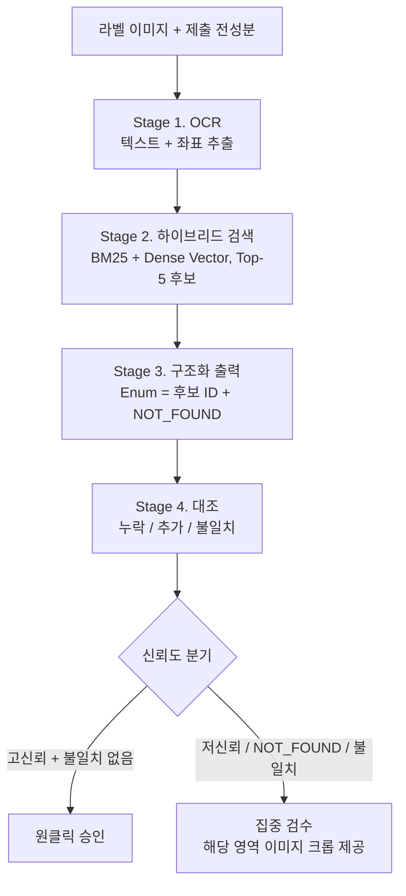

# 화장품 라벨 전성분 검증 파이프라인

라벨 이미지에서 전성분을 추출·정규화하고, 브랜드가 제출한 전성분 데이터와 대조해 **누락·불일치 항목만 사람에게 넘기는** 입점 상품 검수 보조 시스템입니다.

> 그라운딩을 적용한 멀티모달 LLM 대비 **성분 재현율 +8.6%p, 건당 비용 약 83% 절감, 추출 p95 지연 6.2초 → 1.4초**
> (벤치마크 N=100 기준)

---

## 왜 만들었나

입점 심사에서 담당자는 라벨 사진과 제출된 전성분을 한 줄씩 눈으로 대조합니다. 성분이 수십 개라 반복적이고, 하나만 놓쳐도 표시 규정 위반으로 이어질 수 있습니다. 이 업무에서는 **틀린 것보다 놓친 것이 더 치명적**입니다.

그래서 이 프로젝트는 세 가지 원칙으로 설계했습니다.

- **완전 자동화가 아닌 선별 검수:** 시스템이 확신하지 못하는 항목만 사람이 확인
- **재현율 우선:** 모든 설계 결정의 1순위 기준은 "성분을 놓치지 않는 것"
- **DB에 없는 성분은 생성 불가:** 모델이 가상의 성분명을 만들어내는 경로를 구조적으로 차단

---

## 아키텍처 비교 결과

같은 벤치마크셋 100건(정면, 곡면, 반사광 포함)으로 4가지 구조를 비교했습니다.

| 구조 | 제품명 EM | 성분 재현율 | 추출 p95 | 건당 비용 |
| --- | --- | --- | --- | --- |
| 멀티모달 LLM 단독 | 81.0% | 78.4% | 4.6초 | $0.012 |
| 멀티모달 LLM + RAG | 91.0% | 88.2% | 6.2초 | $0.018 |
| OCR + 정규식 | 53.0% | 46.5% | 0.9초 | $0.001 |
| **OCR + RAG + 구조화 출력 (채택)** | **94.0%** | **96.8%** | **1.4초** | **$0.003** |

작은 글자가 밀집된 후면 라벨에서 멀티모달 모델은 성분을 건너뛰는 경향을 보였습니다. 전용 OCR로 텍스트를 먼저 빠짐없이 뽑고 이후를 텍스트 처리로 구성한 구조가 재현율과 비용 모두에서 유리했습니다.

- 측정 시점: `TODO`
- 사용 모델/엔진: `TODO: OCR 엔진`, `TODO: 구조화 출력 모델`, 비교군 GPT-4o-mini

---

## 파이프라인



### 환각 방지 방식

성분 필드의 허용값을 **요청마다 동적으로 생성한 Enum**(검색된 후보 ID + `NOT_FOUND`)으로 제한하는 Strict JSON Schema 구조화 출력을 사용합니다. DB에 없는 성분명은 출력 문법상 생성될 수 없습니다.

### 이 구조가 막지 못하는 오류

- **후보 중 오선택:** 정답이 후보에 있지만 유사 성분을 고르는 경우
- **검색 실패:** 정답이 Top-5 후보에 없는 경우
- **OCR 누락:** OCR이 텍스트를 아예 읽지 못한 경우. 이후 단계로 복구할 수 없으므로 **전체 재현율의 상한은 OCR이 결정**합니다.

이 오류들은 신뢰도 분기와 사람의 검수로 관리합니다.

---

## 평가

| 지표 | 정의 | 용도 |
| --- | --- | --- |
| 제품명 EM | 정규화된 제품명 완전 일치 비율 | 제품 식별 |
| 성분 재현율 | 정답 성분 중 추출된 비율 | **핵심 지표** |
| 성분 정밀도 | 추출 성분 중 정답 비율 | 검수 부담 관리 |
| 불일치 탐지율 | 변형된 제출 데이터에서 누락·추가·치환을 잡아낸 비율 | 대조 성능 (측정 예정) |

평가 실행:

```bash
# TODO: 실제 명령어로 교체
python eval/run_benchmark.py --dataset data/benchmark --pipeline ocr_rag
```

---

## 프로젝트 구조

```
# TODO: 실제 디렉터리 구조로 교체
.
├── pipeline/        # OCR, 검색, 구조화 출력, 대조
├── eval/            # 벤치마크 및 지표 계산
├── data/            # 벤치마크셋, 성분 마스터 DB
└── README.md
```

## 실행 방법

```bash
# TODO: 실제 설치 및 실행 방법으로 교체
git clone <repo-url>
cd <repo>
pip install -r requirements.txt
cp .env.example .env   # API 키 설정
```

- 성분 마스터 DB 출처: `TODO`

---

## 현재 상태

| 항목 | 상태 |
| --- | --- |
| 4안 아키텍처 비교 | 완료 |
| OCR → 검색 → 구조화 출력 파이프라인 | 완료 |
| 대조 (Stage 4) | `TODO` |
| 신뢰도 결합 및 임계치 선정 | 진행 예정 |
| 오류 원인 분석 | 진행 예정 |
| 검수 시간 측정 | 진행 예정 |

## 한계

- **표본 규모:** N=100은 방향 판단에는 충분하지만 99% 수준의 재현율을 검증하기에는 작습니다.
- **DB 커버리지:** 마스터 DB에 없는 신규 원료는 항상 `NOT_FOUND`로 분류됩니다.
- **촬영 품질 의존:** OCR이 재현율 상한을 결정하므로 입력 이미지 품질이 중요합니다.

## 다음 단계

- 규제 성분(금지 원료, 알레르기 유발 성분) 하이라이트
- 비구매처 리뷰 플랫폼 시나리오의 리뷰 작성 보조
- 리뷰 생성 품질 평가 (LLM-as-a-Judge) 및 수정률 기반 피드백 루프